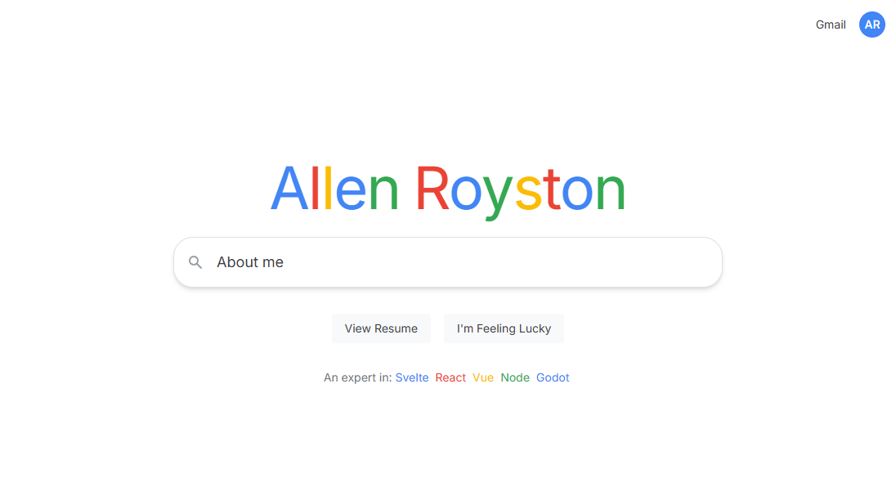

# Allen Royston - Google Mockup CV Portfolio

A Google Search-inspired portfolio website showcasing me! Built with Next.js and TypeScript.



## Features

- 🔍 **Google Search Interface** - Authentic Google-style search with multiple result types (All, Images, Videos, News)
- 🌙 **Dark Mode Support** - Seamless light/dark theme switching with no flash loading
- 📱 **Responsive Design** - Optimized for all devices using Tailwind CSS
- 🎬 **YouTube Integration** - Embedded video players for game development logs
- 📰 **Satirical News Section** - The Onion-style fake news articles for entertainment
- ⚡ **Hash-based Navigation** - Smooth navigation without page reloads
- 🎮 **Game Development Showcase** - Features SCP: Memory Recovery Protocol project

## Tech Stack

- **Framework**: Next.js 15 with App Router
- **Language**: TypeScript
- **Styling**: Tailwind CSS
- **Package Manager**: pnpm
- **Build Tool**: Turbopack

## Getting Started

First, run the development server:

```bash
npm run dev
# or
yarn dev
# or
pnpm dev
# or
bun dev
```

Open [http://localhost:3000](http://localhost:3000) with your browser to see the result.
